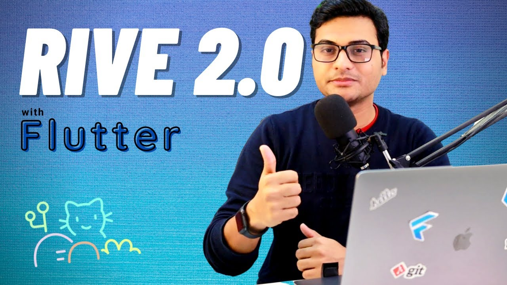

# Flutter ShopX
🎯 API integration | 📲 Staggered Grid View | 🔥 GetX 

  

   
**Tutorial** 👇🏼👇🏼👇🏼 
Integrate REST API with GetX | Flutter tutorial | Shopping app 
https://youtu.be/apPH1CCOtKQ

🔥 Rive Animation | 🌃 Dark Theme   (branch : dark_theme)

  

   
**Tutorial** 👇🏼👇🏼👇🏼 
Weekly Livestream | Dark theme animation with Rive 2.0 
https://youtu.be/LK0jsoJs2lU

 If you like my work, support me to create more! 😎👍 

## Getting Started

This project is a starting point for a Flutter application.

A few resources to get you started if this is your first Flutter project:

- [Lab: Write your first Flutter app](https://flutter.dev/docs/get-started/codelab)
- [Cookbook: Useful Flutter samples](https://flutter.dev/docs/cookbook)

For help getting started with Flutter, view our
[online documentation](https://flutter.dev/docs), which offers tutorials,
samples, guidance on mobile development, and a full API reference.
